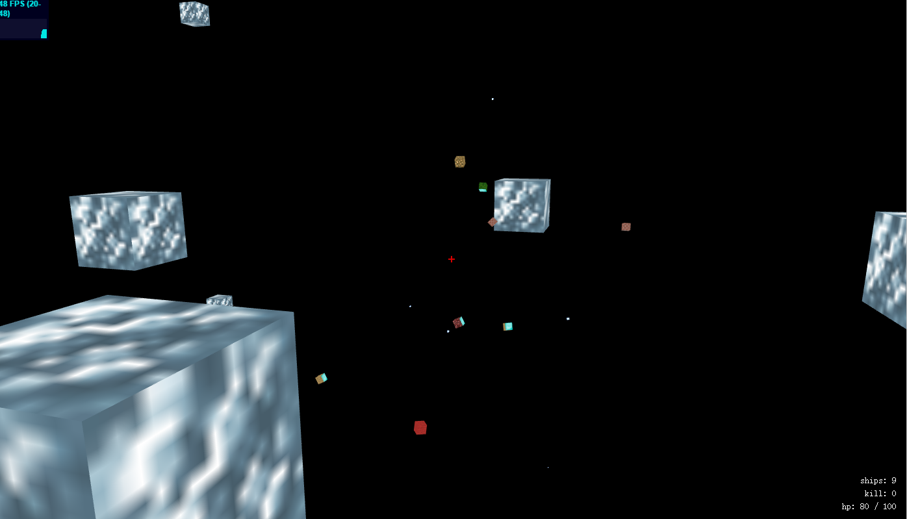

# 空间大战 `spacewar`



3d的飞船射击游戏，与npc混战，键盘W/S/A/D/R/F前后左右升降，鼠标控制视角，点左键射击。进入即玩，刷新再来。背景音乐，物理音效，语音播报。

支持新版本chrome/firefox。游戏演示 ~~<http://spacewar.coding.io/>~~ <http://fritx.me/spacewar/>

## 背景说明

2013年5/6月份鼓捣three.js，喜欢第一人称射击，于是造了这个游戏，空间大战。后来想移植到mobile，苦于webgl支持不好，未果。想借websocket做成多人在线版本，也未果。

如今拿出，希望做些修改，参加coding的HTML5大赛，因为它非常符合。项目开源，欢迎小伙伴前来观摩、交流思想、提交代码。希望大家~~[投我一票](https://coding.net/event/html5/vote?page=1)~~，谢谢。

## 游戏亮点

- 3d，第一人称，飞船射击
- 进入即玩，刷新再来
- 与机智敏捷的npc混战
- 环绕音响，激情澎湃的背景音乐
- 各种物理音效
- 骚气的语音播报
- 不限定的地图定制

## 用到的HTML5技术

- 基于three.js的canvas-3d动画渲染
- webgl硬件加速
- audio标签音频播放
- 开启全屏的js-api
- 锁定鼠标指针的js-api

## 未来的改变

- 为代码添加注释，便于大家阅读
- 生产环境使用七牛cdn加载静态资源 √
- 更新three.js等陈旧依赖，使用最新api
- 重写过去的一些错误/过度设计
- 让npc的ai更丰富
- 使用飞船模型，而不是方块
- 更加奇形怪状的地图

## 部分文件结构说明

```plain
- game/
  - Driver.js    # 驱动类抽象
  - AIDriver.js    # AI驱动，弱智决策
  - UserDriver.js    # 玩家驱动，绑定鼠标/键盘
  - Unit.js    # 单位类抽象
  - Station.js    # 空间站，摆设
  - Ship.js    # 飞船
  - Missile.js    # 导弹，杀伤
  - World.js    # 世界类，主程序
- lib/
  - jquery.min.js    # 用于dom操作
  - stats.min.js    # 实时显示性能数据
  - three.min.js    # 用于3d绘图
  - class.js    # 用于快速编写简单类
  - locker.js    # 全屏/锁鼠api
  - Timer.js    # 计时相关
  - SoundPlayer.js    # 声音播放点，3d定位
```
